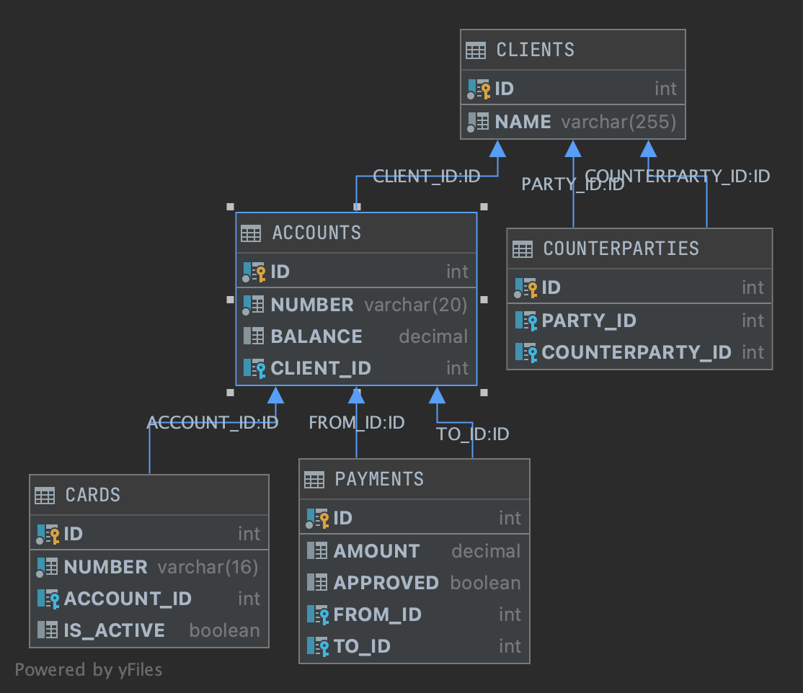

## Bank API

### ER-diagram



## API

## `Accounts`

### Get balance

```
Request

GET http://localhost:8080/api/accounts/1/balance
```

```
Response

HTTP/1.1 200 
Content-Type: application/json
Transfer-Encoding: chunked
Date: Mon, 24 May 2021 08:16:53 GMT
Keep-Alive: timeout=60
Connection: keep-alive

{
  "id": 1,
  "number": "14883228111122225555",
  "balance": 3000.0,
  "clientId": 1
}
```

### Get by id (Not Found)

```
Request

GET http://localhost:8080/api/accounts/12/balance
```

```
Response

HTTP/1.1 404 
Content-Type: application/json
Transfer-Encoding: chunked
Date: Mon, 24 May 2021 08:30:52 GMT
Keep-Alive: timeout=60
Connection: keep-alive

{
  "error": "Данного счета не существует!"
}

```

### Increase balance

```
Request

PUT http://localhost:8080/api/accounts/1/increase
Content-Type: application/json

{
  "amount": 1000
}
```

```
Response

HTTP/1.1 200 
Content-Type: application/json
Transfer-Encoding: chunked
Date: Mon, 24 May 2021 08:35:44 GMT
Keep-Alive: timeout=60
Connection: keep-alive

{
  "id": 1,
  "number": "14883228111122225555",
  "balance": 4000.0,
  "clientId": 1
}
```

### Create account

```
Request

POST http://localhost:8080/api/accounts
Content-Type: application/json

{
  "clientId": 1
}
```

```
Response

HTTP/1.1 200 
Content-Type: application/json
Transfer-Encoding: chunked
Date: Mon, 24 May 2021 08:39:02 GMT
Keep-Alive: timeout=60
Connection: keep-alive

{
  "id": 4,
  "number": "38423281348846275626",
  "balance": 0.0,
  "clientId": 1
}
```

## `Cards`

### Get all cards attached to account

```
Request

GET http://localhost:8080/api/cards/1/cards
```

```
Response

HTTP/1.1 200 
Content-Type: application/json
Transfer-Encoding: chunked
Date: Mon, 24 May 2021 08:43:38 GMT
Keep-Alive: timeout=60
Connection: keep-alive

[
  {
    "id": 1,
    "number": "1488322845651234",
    "accountId": 1,
    "active": false
  },
  {
    "id": 2,
    "number": "3228148845671234",
    "accountId": 1,
    "active": false
  }
]

```

### Create a new card for account

```
Request

POST http://localhost:8080/api/cards/1/create
Content-Type: application/json
{}
```

```
Response

HTTP/1.1 200 
Content-Type: application/json
Transfer-Encoding: chunked
Date: Mon, 24 May 2021 08:48:11 GMT
Keep-Alive: timeout=60
Connection: keep-alive

{
  "id": 4,
  "number": "6197178181299228",
  "accountId": 1,
  "active": false
}
```

### Activate card

```
Request

PUT http://localhost:8080/api/cards/1/activate
```

```
Response

HTTP/1.1 200 
Content-Type: application/json
Transfer-Encoding: chunked
Date: Mon, 24 May 2021 08:49:05 GMT
Keep-Alive: timeout=60
Connection: keep-alive

{
  "id": 1,
  "number": "1488322845651234",
  "accountId": 1,
  "active": true
}
```

## `Clients`

### Get counterparty list

```
Request

GET http://localhost:8080/api/clients/counterparties/1
```

```

Response

HTTP/1.1 200 
Content-Type: application/json
Transfer-Encoding: chunked
Date: Mon, 24 May 2021 08:52:48 GMT
Keep-Alive: timeout=60
Connection: keep-alive

[
  {
    "id": 2,
    "name": "Petrov Petr"
  }
]
```

### Create counterparty

```
Request

POST http://localhost:8080/api/clients/counterparties
Content-Type: application/json

{
  "partyID": 1,
  "counterPartyId": 3
}
```

```
Response

HTTP/1.1 200 
Content-Type: application/json
Transfer-Encoding: chunked
Date: Mon, 24 May 2021 08:55:27 GMT
Keep-Alive: timeout=60
Connection: keep-alive

{
  "id": 3,
  "name": "Zhmishenko Valeriy"
}
`````

### Create new client

```
Request

POST http://localhost:8080/api/clients
Content-Type: application/json

{
  "name" : "Ryabov Leonid"
}
```

```
Response

HTTP/1.1 200 
Content-Type: application/json
Transfer-Encoding: chunked
Date: Mon, 24 May 2021 08:59:20 GMT
Keep-Alive: timeout=60
Connection: keep-alive

{
  "id": 4,
  "name": "Ryabov Leonid"
}
`````

## `Payments`

### Create payment

```
Request

POST http://localhost:8080/api/payments
Content-Type: application/json

{
  "amount": 2000,
  "fromId": 1,
  "toId": 2
}
```

```
Response

HTTP/1.1 200 
Content-Type: application/json
Transfer-Encoding: chunked
Date: Mon, 24 May 2021 09:03:45 GMT
Keep-Alive: timeout=60
Connection: keep-alive

{
  "id": 4,
  "amount": 2000.0,
  "approved": false,
  "fromId": 1,
  "toId": 2
}
```

### Confirm payment

```
Request

PUT http://localhost:8080/api/payments/1/approve
```

```
Response

Transfer-Encoding: chunked
Date: Mon, 24 May 2021 09:05:18 GMT
Keep-Alive: timeout=60
Connection: keep-alive

{
  "id": 1,
  "amount": 1000.0,
  "approved": true,
  "fromId": 1,
  "toId": 2
}
```

### Confirm payment (Bad request)

```
Request

PUT http://localhost:8080/api/payments/1/approve
```

```
Response

HTTP/1.1 400 
Content-Type: application/json
Transfer-Encoding: chunked
Date: Mon, 24 May 2021 09:06:39 GMT
Connection: close

{
  "error": "Данный платеж уже подтвержден"
}
```